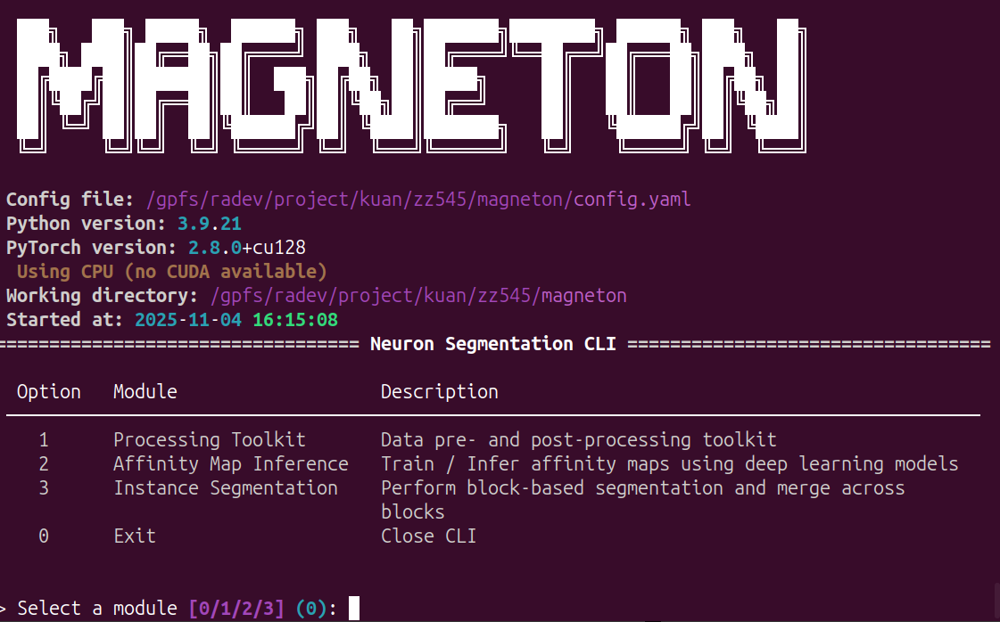
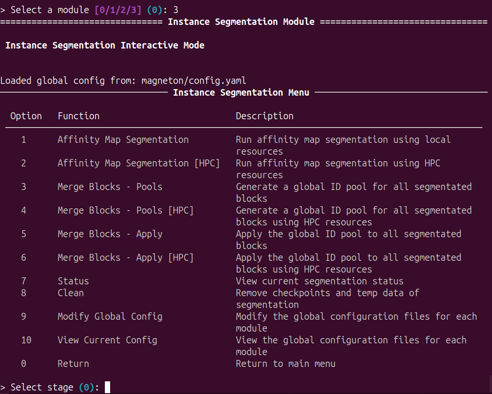
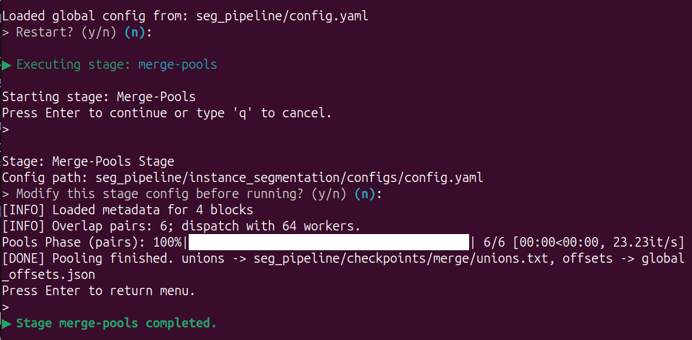
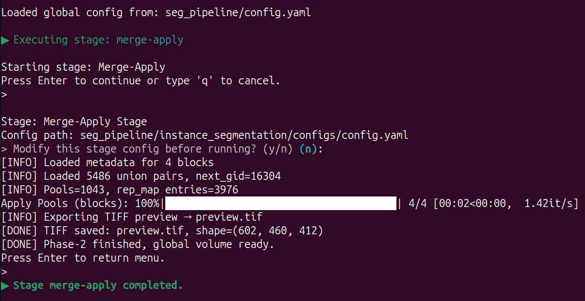
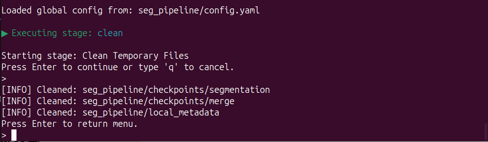

# Instance Segmentation
This tutorial provides step-by-step guidance for instance segmentation pipeline.

#### Main Menu

Run ```python -m magneton``` to start the CLI.



Input ```3``` and ```Enter```, enter the **instance segmentation module**:


 
#### Options

This module can be used for configuration, affinity map segmentation by blocks, blocks merging and management.

- In affinity map segmentation: perform superpixelization and aggregation on precomputed affinity maps in block-wise fashion to generate instance segmentation results for neurons.

- In blocks merging: due to segmentation instability and field-of-view limitations, this module performs the most optimal merging of instance segmentation results for each neural network block.

##### Global Configuration
This section is identical to the previous configuration. Only an interface has been added to facilitate configuration.
Input ```10``` and ```Enter```, view current **global configuration**:
Input ```9``` and ```Enter```, edit current **global configuration**.


##### Affinity map segmentation by blocks

Input ```1``` and ```Enter```, using ***local resources*** to perform affinity map segmentation by blocks.

Input ```2``` and ```Enter```, using ***HPC resources*** to perform affinity map segmentation by blocks. 

The module is based on the configuration files (```main``` ,  in global configuration file)

Before start the training, you can modify the configuration:


This step perform superpixelization and aggregation on precomputed affinity maps in block-wise fashion to generate instance segmentation results for neurons

##### Blocks merging: pools

Input ```3``` and ```Enter```, using ***local resources*** to generate a global ID pool for all blocks.
Input ```4``` and ```Enter```, using ***HPC resources*** to generate a global ID pool for all blocks.

The module is based on the configuration files (```main``` ,  in global configuration file). And before start the training, you can modify the configuration.

This step perform counting and calculating the global ID based on the intersection areas between blocks, and outputs a global ID pool.

The process is fast and uses minimal memory. You can directly use local resources or manually allocate HPC resources.


##### Blocks merging: apply 

Input ```5``` and ```Enter```, using ***local resources*** to apply the global ID pool to all blocks and output a precomputed data of full volume.
Input ```6``` and ```Enter```, using ***HPC resources*** to apply the global ID pool to all blocks and output a precomputed data of full volume.

The module is based on the configuration files (```main``` ,  in global configuration file). And before start the training, you can also modify the configuration.

Based on the previously computed ID pool, this step applies it to all blocks and progressively writes it into the precomputed data.

You can directly use local resources or manually allocate HPC resources.



##### Status
Input ```7``` and ```Enter```, enter the **Status Info**. This section indicates which blocks have been successfully segmentated:


##### Clean
Input ```8``` and ```Enter```, enter the **Clean Function**. This section clear cache files and checkpoints of merging.



